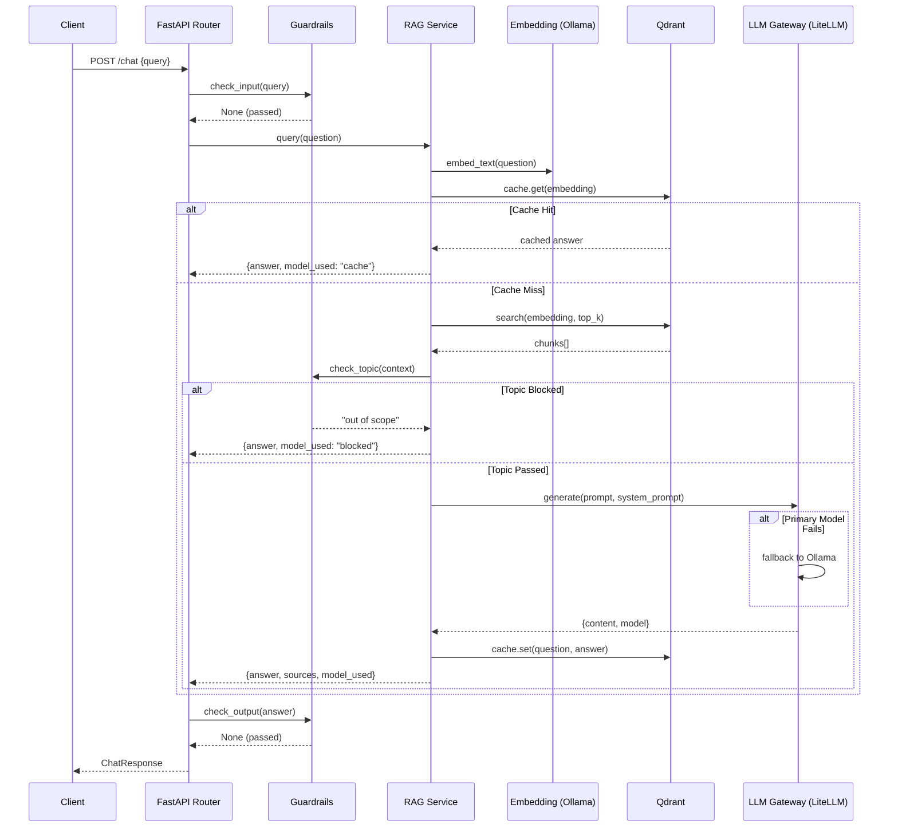

# Enterprise AI Knowledge Hub & LLM Gateway

<p align="center">
  
  
  
  
  
  
  
</p>

<p align="center">
  <b>Enterprise-grade RAG system with LLM Gateway, Semantic Caching, and Guardrails</b>
</p>

---

## Overview

An organizational knowledge management system that enables intelligent document Q&A through advanced **Retrieval-Augmented Generation (RAG)** architecture. The system supports multi-model LLM routing with automatic fallback, semantic caching for performance optimization, and multi-layer guardrails for security and compliance.

### Key Highlights

- **LLM Gateway Pattern** — Unified interface to multiple LLM providers via LiteLLM with automatic fallback (cloud → local Ollama)
- **Advanced RAG Pipeline** — Embed → Search → Context Assembly → Generation with configurable top-k retrieval
- **Semantic Caching** — Qdrant-powered cache that recognizes semantically similar questions and returns cached answers
- **Multi-Layer Guardrails** — Input moderation, topic containment, and output filtering (regex-based + NeMo Guardrails ready)
- **Structured Observability** — JSON structured logging with filterable fields + Langfuse tracing
- **Docker-Native** — Layer-cached Dockerfile + docker-compose for one-command deployment

---

## Architecture

```
┌──────────┐     ┌──────────────┐     ┌───────────────┐     ┌──────────────┐     ┌────────────────────────┐
│          │     │              │     │               │     │              │     │                        │
│  Client   ────▶  FastAPI     ────▶  Guardrails  ────▶  RAG Service ────▶ LLM Gateway (LiteLLM)        │
│          │     │  Router      │     │   Service     │     │              │     │                        │
└──────────┘     └──────────────┘     └───────────────┘     └──────────────┘     │  ┌─────────┐ ┌───────┐ │
                                                                                 │  │ Primary │ │Fallback │
                                                                                 │  │ (Cloud) │ │(Ollama) │
                                                                                 │  └─────────┘ └───────┘ │
                                                                                 └────────────────────────┘
                                                                                          ▲
                                                                                          │
┌──────────────┐     ┌──────────────┐      ┌──────────────────────────────────────────────┘
│              │     │              │      │
│  Embedding   │────▶│   Qdrant     │────▶│
│  (Ollama)    │     │  Vector DB   │
│              │     │              │
└──────────────┘     │ ┌──────────┐ │
                     │ │Documents │ │
                     │ │Collection│ │
                     │ └──────────┘ │
                     │ ┌──────────┐ │
                     │ │  Cache   │ │
                     │ │Collection│ │
                     │ └──────────┘ │
                     └──────────────┘
```

### Request Flow



---

## Tech Stack

| Component | Technology | Purpose |
|-----------|-----------|----------|
| **Web Framework** | FastAPI 0.138 | Async API with DI & middleware |
| **LLM Routing** | LiteLLM 1.90 | Multi-provider model routing & fallback |
| **Local LLM** | Ollama | On-premise fallback model |
| **Vector DB** | Qdrant 1.18 | High-performance vector similarity search |
| **Embeddings** | Ollama (nomic-embed-text) | Local text embedding generation |
| **Guardrails** | Custom Regex + NeMo Guardrails | Input/output moderation & topic containment |
| **Tracing** | Langfuse | LLM call observability & evaluation |
| **Logging** | Python structlog-style JSON | Structured, filterable logs |
| **Containerization** | Docker + Docker Compose | Reproducible deployment |
| **Testing** | pytest + pytest-asyncio | Unit tests with mock-based isolation |

---

## Features

### 🛡️ LLM Gateway
- Unified API for multiple LLM providers via LiteLLM
- Automatic fallback from cloud models to local Ollama
- Response includes `model_used` for tracking which model served the request

### 🔍 RAG Pipeline
- Document upload via text or file (PDF, DOCX, TXT)
- Configurable chunking (size + overlap)
- Top-k semantic search with optional document filtering
- System prompt assembly with retrieved context

### ⚡ Semantic Cache
- Separate Qdrant collection for cache isolation
- Cosine similarity threshold (0.91) for cache matching
- Zero-dependency architecture — uses existing Qdrant instance

### 🛡️ Guardrails
- **Input Moderation** — Prompt injection, sensitive data, length limits
- **Topic Rail** — Blocks out-of-scope questions when no relevant context found
- **Output Filtering** — Redacts API keys, tokens, and credentials from responses
- **NeMo Ready** — Colang config for LLM-based guardrails (conditional activation)

### 📝 Observability
- JSON structured logging with `extra={}` for filterable fields
- Langfuse integration (conditional — only activates when API keys provided)
- Request timing middleware

---

## Project Structure

```
.
├── app/
│   ├── api/
│   │   ├── routes/
│   │   │   ├── chat.py            # Chat with RAG + LLM
│   │   │   ├── query.py           # Pure semantic search
│   │   │   └── documents.py      # Document upload & management
│   │   └── __init__.py
│   ├── core/
│   │   ├── config.py           # Pydantic Settings
│   │   ├── logging.py          # Structured JSON logging
│   │   ├── tracing.py          # Langfuse integration
│   │   └── exceptions.py       # Custom exceptions
│   ├── guardrails/
│   │   ├── __init__.py          # Factory + conditional NeMo activation
│   │   ├── service.py           # GuardrailsService (input/topic/output)
│   │   └── config/
│   │       └── config.yml         # NeMo Colang configuration
│   ├── models/
│   │   ├── chat.py
│   │   ├── document.py
│   │   └── query.py
│   ├── services/
│   │   ├── __init__.py          # DI factory functions
│   │   ├── rag_service.py      # Core RAG pipeline
│   │   ├── llm_service.py     # LLM Gateway with fallback
│   │   ├── vector_store.py    # Qdrant CRUD operations
│   │   ├── embedding_service.py # Ollama embedding
│   │   ├── cache_service.py    # Semantic cache
│   │   └── document_parser.py  # Multi-format parser
│   └── main.py                # FastAPI app, lifespan, middleware
├── tests/
│   ├── __init__.py
│   ├── conftest.py          # Shared test fixtures
│   ├── test_guardrails.py   # 6 tests
│   ├── test_llm_service.py   # 2 tests
│   └── test_rag_service.py   # 3 tests
├── Dockerfile
├── docker-compose.yml
├── .env.example
├── .dockerignore
├── requirements.txt
└── pyproject.toml
```

---

## Quick Start

### Prerequisites

- Docker & Docker Compose
- Ollama running locally (for embeddings and fallback LLM)

### 1. Clone & Configure

```bash
git clone https://github.com/<your-username>/enterprise-ai-knowledge-hub.git
cd enterprise-ai-knowledge-hub
cp .env.example .env
```

### 2. Start Ollama & Pull Models

```bash
# Start Ollama
ollama serve

# Pull embedding model
ollama pull nomic-embed-text

# Pull fallback LLM (optional)
ollama pull llama3
```

### 3. Set Environment Variables

Edit `.env` and configure:

| Variable | Description | Default |
|----------|-------------|----------|
| `LLM_MODEL_NAME` | Primary LLM model | `gpt-4o-mini` |
| `LLM_API_KEY` | Primary LLM API key | — |
| `LLM_FALLBACK_MODEL` | Fallback model (Ollama) | `ollama/llama3` |
| `OLLAMA_BASE_URL` | Ollama server URL | `http://localhost:11434` |
| `QDRANT_URL` | Qdrant server URL | `http://qdrant:6333` |
| `QDRANT_API_KEY` | Qdrant API key (optional) | — |
| `QDRANT_COLLECTION` | Main collection name | `documents` |
| `LANGFUSE_PUBLIC_KEY` | Langfuse public key (optional) | — |
| `LANGFUSE_SECRET_KEY` | Langfuse secret key (optional) | — |
| `LANGFUSE_HOST` | Langfuse host URL (optional) | — |

### 4. Run with Docker Compose

```bash
docker compose up --build
```

The API will be available at `http://localhost:8000`

API docs: `http://localhost:8000/docs`

---

## API Endpoints

### Documents

| Method | Endpoint | Description |
|--------|----------|-------------|
| `POST` | `/documents` | Add text content as a document |
| `POST` | `/documents/upload` | Upload a file (PDF, DOCX, TXT) |
| `DELETE` | `/documents/{document_id}` | Delete a document and all its chunks |

### Chat (RAG + LLM)

| Method | Endpoint | Description |
|--------|----------|-------------|
| `POST` | `/chat` | Ask a question — full RAG pipeline with LLM |

**Request:**
```json
{
  "query": "How much does this laptop cost?",
  "top_k": 3,
  "document_id": null
}
```

**Response:**
```json
{
  "answer": "The price is 1500$",
  "sources": [
    {
      "text": "...",
      "document_id": "...",
      "score": 0.92,
      "metadata": {}
    }
  ],
  "model_used": "gpt-4o-mini"
}
```

> `model_used` can be: the model name, `"cache"` (semantic cache hit), `"blocked"` (topic guardrail), or `"filtered"` (output guardrail).

### Semantic Search

| Method | Endpoint | Description |
|--------|----------|-------------|
| `POST` | `/query` | Search documents without LLM — pure vector similarity |

---

## Testing

```bash
# Run all tests with verbose output
python -m pytest tests/ -v

# Run a specific test file
python -m pytest tests/test_guardrails.py -v

# Run with coverage (if pytest-cov installed)
python -m pytest tests/ -v --cov=app
```

### Test Coverage

| Module | Tests | Description |
|--------|-------|-------------|
| `GuardrailsService` | 6 | Input moderation, output filtering, disabled state |
| `LLMService` | 2 | Successful generation, model fallback |
| `RAGService` | 3 | Full pipeline, cache hit, topic blocked |

---

## Design Decisions

### 1. Why LiteLLM over direct OpenAI SDK?
Unified interface to 100+ LLM providers with built-in retry, fallback, and caching. Switching models requires only an env variable change.

### 2. Why Qdrant for both documents and cache?
Avoids adding Redis as an infrastructure dependency. Separate collections provide isolation while sharing the same Qdrant instance.

### 3. Why regex-based guardrails by default?
Zero latency overhead compared to LLM-based guardrails. NeMo Guardrails is available as an opt-in layer for production environments requiring deeper analysis.

### 4. Why lazy import for guardrails in services/__init__.py?
Breaks the circular import chain: `guardrails → services → guardrails`. The import is deferred to runtime when all modules are already loaded.

---

## License

MIT
